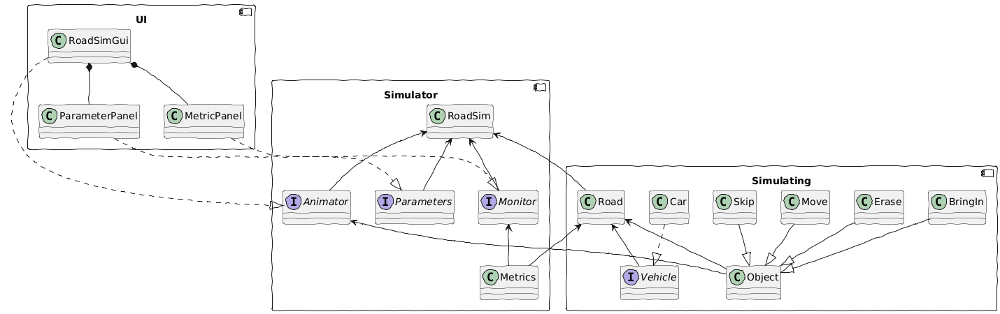

### Design

generate the UML diagrams with
```
plantuml -tpng README.md
```

design diagram
```plantuml
@startuml roadsim
!option handwritten true

component UI {
    class RoadSimGui
    class ParameterPanel
    class MetricPanel

    RoadSimGui *-- ParameterPanel
    RoadSimGui *-- MetricPanel
}

component Simulator {
    interface Monitor
    interface Parameters
    interface Animator

    class RoadSim

    class Metrics
    Monitor <-- Metrics
}

MetricPanel ..|> Monitor
ParameterPanel ..|> Parameters
RoadSimGui ..|> Animator
RoadSim <-- Monitor
RoadSim <-- Parameters
RoadSim <-- Animator

component Simulating {
    class Road
    Road <-- Vehicle

    interface Vehicle
    class Car

    Car ..|> Vehicle

    class Object
    class Skip
    class Move
    class Erase
    class BringIn

    Skip --|> Object
    Move --|> Object
    Erase --|> Object
    BringIn --|> Object
}

RoadSim <-- Road
Animator <-- Object
Road <-- Metrics
Road <-- Object

@enduml
```


that is a lot of structure for a small problem.


### Run

run it on Sway
```
make RoadSim
make runway
```

run tests
```
make tests
```
